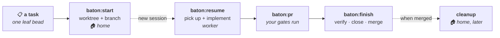

# maestro

**Workflow orchestration for [Claude Code](https://claude.com/claude-code).**

A *maestro* conducts an orchestra: one score, many players, nobody stepping on anyone else.
That's the whole idea — these plugins handle the **orchestration** of solo development work so
you stay at the podium. You decide what gets played and when; fresh worker sessions do the
playing, each in its own isolated worktree, and each one comes home for your review.

Orchestration here means the unglamorous coordination you'd otherwise do by hand: which
tracker owns this task, which repo and branch it belongs on, spinning up a session with the
right context loaded, running the right checks before a PR, and tidying up afterward.

## Plugins

| Plugin | Prefix | What it does |
|--------|--------|--------------|
| [**baton**](./baton) | `baton:` | Context-aware, [beads](https://github.com/steveyegge/beads)-backed **git-worktree workflow orchestrator**. Auto-detects which context (set of projects) you're in, dispatches a task to an isolated worker session in its own worktree, and cleans up on your say-so. |

## 🎼 What it looks like

You sit in a **home session** and pass tasks out. Each one becomes a single tracked issue, its own
branch, its own worktree, and its own **worker session** — which figures out what it's working on
from a small identity record inside the worktree's git dir, so nothing lands in the working tree
and the branch is free to follow whatever naming your organisation mandates.



Your own checks run at the gates, the task closes itself out, and finished worktrees are removed
later — automatically when every signal agrees it's done, and never without asking when they
don't. **[The full workflow, with all six hook points →](./baton/README.md#-the-workflow-end-to-end)**

## 🧭 Many worlds, one tool — and they never mix

> [!IMPORTANT]
> **Your side projects, your day job, and the open-source org you help maintain are three
> different worlds. baton keeps them that way.**
>
> Each is a **context** — with its own task tracker, its own GitHub owner, its own startup
> routine, its own PR gates, and its own accumulated preferences. Add as many as you like.
> Nothing bleeds across.

|  | 🏠 `personal` | 💼 `work` | 🌍 `oss` |
|---|---|---|---|
| **Task tracker** | `~/code/personal-tracking` | `~/work/acme-tracking` | `~/code/oss-tracking` |
| **GitHub owner** | `your-user` | `acme-corp` | `some-org` |
| **New repo prefix** | — | `acme-` | — |
| **Work mode** | worktree + new session | worktree + new session | in-place |
| **Startup routine** | align → status | align → doctor → cleanup → status | align → status |
| **PR gate** | — | typecheck, test, changelog | lint, test, DCO |
| **Preferences** | terse commits | ticket refs, never force-push | conventional commits |

**You never pick one manually.** `cd` into a repo and the right context activates — baton
matches your directory against each context's member repos. A task you start at work is filed
in the work tracker, opened under the work org, and gated by the work checks. Worktree cleanup
only ever offers up the active context's worktrees, so a Friday tidy-up can't touch your
employer's repos.

One plugin, one set of skills, one mental model — however many worlds you work in.

## 🔄 It updates itself — twice over

> [!TIP]
> **You never run an update command, and you never re-teach it the same lesson.**

**The plugin keeps itself current.** Every home session opens with the `align` task, which
pulls your repos, syncs the tracker, and runs `claude plugins update baton@maestro` for you —
then tells you whether anything actually changed, including the easily-missed case where an
update has landed but this session is still running the old skills until you restart. New
skills and fixes land the next time you sit down. Nothing to watch, nothing to remember.

**And the workflow keeps improving itself — by asking.** Every task ends with a retrospective.
`baton:finish` puts one question to you:

> *Anything in this flow that could have gone better?*

Say "nothing" and you're done. Say something, and baton works out whether it implies a standing
preference, a lifecycle hook, or a config change — then proposes that exact edit to your
workspace and applies it once you confirm. Next task, it's already in force.

That's the loop: **every iteration, one question, and the answer becomes part of the workflow.**
Tell it once that this project squashes commits, or that PRs here need a changelog entry, and it
holds — no re-teaching. `baton:remember` writes the same file on demand, anytime.

The result compounds: **corrections become configuration.** And because guidance is per-context,
each world sharpens on its own terms — your work conventions never leak into your OSS commits.
No forks, no plugin edits, no drift.

## Install

```sh
# Add this marketplace (from GitHub, or a local clone)
claude plugins marketplace add <you>/maestro
# or: claude plugins marketplace add ~/code/maestro

# Install a plugin from it
claude plugins install baton@maestro
```

Then run `baton:setup` (one-time machine bootstrap) and `baton:configure` (create your
first context). See the [baton README](./baton/README.md) for the full walkthrough.

## Design principles

- **Config-driven, not hardcoded.** The plugins are generic. Everything you'd tailor —
  which repos belong to which context, task-tracker location, startup routine, lifecycle
  hooks, preferences — lives in *your own* config repos, never in a plugin. You adapt the
  workflow to your world without forking or editing the plugin. See the annotated
  [`context.example.yaml`](./baton/references/context.example.yaml) for the full config
  surface.
- **Isolated by default.** Contexts share nothing but the registry that lists them. Separate
  trackers, separate owners, separate hooks, separate learned preferences — so orchestrating
  many worlds never means merging them.
- **Solo-first.** No team ceremony, no human-to-human coordination assumptions.
- **Looking is free.** Every "where does this stand?" question has an answer that changes
  nothing — `baton:whereami` for the context, `baton:status` for the task in the current
  worktree. A report you have to think twice about running is one you skip precisely when you're
  most lost, so the read-only skills write nothing at all.
- **You stay in control.** Destructive steps (like removing a worktree) are always
  review-and-confirm, never silent.
- **Interface first, specifics second.** When adding or changing a feature, define the seam
  before the implementation — the verb set, the data it passes, the extension point in config —
  and only then write the backend that satisfies it. Build the concrete case first and the
  abstraction gets reverse-engineered from one example, which is how you end up with a seam
  shaped like its only implementation. This applies even when just one backend will exist:
  defining the interface is cheap, retrofitting one is not.

## License

MIT — see [LICENSE](./LICENSE).
