# baton

**Context-aware, [beads](https://github.com/steveyegge/beads)-backed git-worktree workflow
orchestrator for Claude Code.** You conduct from a home session; each task is handed off —
*passed the baton* — to a fresh worker session running in its own git worktree, tracked by a
single bead, and brought home for review-and-confirm cleanup when it's done.

Part of the [maestro](../README.md) plugin collection. Prefix: `baton:`.

---

## 🧭 Many worlds, one tool — and they never mix

> [!IMPORTANT]
> **Your side projects, your day job, and the open-source org you help maintain are three
> different worlds. baton keeps them that way.**
>
> Each is a **context** — its own task tracker, GitHub owner, code root, startup routine, PR
> gates, and accumulated preferences. Add as many as you like. Nothing bleeds across.

```
~/.config/baton/registry.yaml          ← lists your workspaces; the only shared file
        │
        ├── ~/code/personal-workspace/     🏠 personal
        │      context.yaml                   tracker: ~/code/personal-tracking
        │      guidance.md                    owner:   your-user
        │                                     gate:    (none)
        │
        ├── ~/work/acme-workspace/         💼 work
        │      context.yaml                   tracker: ~/work/acme-tracking
        │      guidance.md                    owner:   acme-corp
        │                                     gate:    typecheck, test, changelog
        │
        └── ~/code/oss-workspace/          🌍 oss
               context.yaml                   tracker: ~/code/oss-tracking
               guidance.md                    owner:   some-org
                                              gate:    lint, test, DCO
```

**You never pick one manually.** `cd` into a repo and the right context activates — baton
matches your directory against each context's `member_repos`. A task you start at work is
filed in the work tracker, opened under the work org, and gated by the work checks. Even
`baton:cleanup-worktrees` scopes to the active context by default, so a Friday tidy-up in your
personal session can't offer up your employer's worktrees.

Each context also *learns separately*: `baton:remember` and the retrospective fold preferences
into that context's own `guidance.md`. Your work conventions never leak into your OSS commits.

## 🔄 It updates itself — twice over

> [!TIP]
> **You never run an update command, and you never re-teach it the same lesson.**

**The plugin keeps itself current.** The `align` startup task — first in the default
`startup_tasks`, so it runs every time you open a home session — refreshes the marketplace and
runs `claude plugins update baton@maestro` unconditionally, then reports the result: up to
date, a restart needed to pick up an update that already landed, or a problem worth looking at
([why it doesn't gate the update on a version comparison](#is-the-plugin-actually-current)). It
also fast-forwards your member repos and syncs the context's tracker in the same pass, failing
soft so one bad pull never blocks the rest.

**And the workflow keeps improving itself — by asking.** Every task ends with a retrospective.
With `retro.enabled` (default: on, at `finish`), `baton:finish` puts one question to you:

> *Anything in this flow that could have gone better?*

Answer "nothing" and it stops there. Answer with something and baton classifies it — a durable
preference, a lifecycle hook, or a config change — then **proposes the specific edit** and
applies it only once you confirm. Say a project needs a changelog entry before every PR and it
becomes a `worker.pre_pr` hook; say you prefer terse commit subjects and it becomes a line in
`guidance.md`, which every skill loads on every run. `baton:remember` writes the same file on
demand, anytime.

Every iteration asks, so the workflow converges on how *you* work — one answer at a time. (The
prompt is skipped for `autonomous-safe` tasks, where no human is present to ask, and
`retro.when` controls which points trigger it.)

**Corrections become configuration** — and since `guidance.md` lives in each context's own
workspace repo, the learning is per-world and versioned in git. Your work conventions never
leak into your OSS commits, and you can see exactly when a preference was added, and why.

### Why this beats hand-rolling it

If you run several unrelated project sets and lean on git worktrees to parallelize, you end up
hand-managing a lot: which tracker to use, which repos belong where, spinning up sessions, and
cleaning up worktrees afterward. baton turns that into a small set of skills driven entirely by
**per-context config you own** — so the same plugin serves every context, and anyone can adopt
it by writing their own config (no plugin edits).

## 🎼 The workflow, end to end

One task travels through **three sessions**, and the only thing carried between them is a small
identity record inside the worktree's own git dir. Six skills, in order:

```mermaid
flowchart LR
    subgraph HOME["🏠 home session (orchestrator)"]
        direction TB
        SS["<b>baton:session-start</b><br/><i>align · doctor · cleanup · status</i>"]
        ST1["<b>baton:start</b><br/>resolve the leaf bead"]
        ST2["create worktree + branch<br/><code>git worktree add</code>"]
        HD(["hooks.home.on_dispatch"])
        ST3["hand off per work_mode<br/><i>launch worker session</i>"]
        SS --> ST1 --> ST2 --> HD --> ST3
    end

    subgraph WORKER["🌿 worker session (inside the worktree)"]
        direction TB
        RS["<b>baton:resume</b><br/>read leaf from the worktree carrier, load bead"]
        MC{"branch already<br/>merged?"}
        WR(["hooks.worker.on_resume"])
        IMPL["implement the acceptance criteria"]
        PR1["<b>baton:pr</b>"]
        WP(["hooks.worker.pre_pr"])
        PR2["doc pass → <code>gh pr create</code>"]
        FI1["<b>baton:finish</b>"]
        WF(["hooks.worker.pre_finish"])
        FI2["verify criteria → doc pass → close bead"]
        WPF(["hooks.worker.post_finish"])
        FI3["label <code>ready-for-worktree-delete</code><br/>(+ <code>no-pr-needed</code> if nothing to merge)<br/>→ retrospective"]
        RS --> MC
        MC -->|no| WR --> IMPL --> PR1 --> WP --> PR2 --> FI1 --> WF --> FI2 --> WPF --> FI3
        MC -->|"yes — nothing to implement"| FI1
    end

    subgraph LATER["🏠 a later home session"]
        direction TB
        CW["<b>baton:cleanup-worktrees</b><br/><i>classify each worktree</i>"]
        CW2["remove worktree + branch"]
        HC(["hooks.home.on_cleanup"])
        CW --> CW2 --> HC
    end

    ST3 -.->|new session| RS
    FI3 -.->|"label read later"| CW

    classDef hook stroke-width:3px,stroke-dasharray:5 4;
    class HD,HC,WR,WP,WF,WPF hook;
```



The dashed nodes are **lifecycle hook points** — the six places your context injects its own
behaviour (see [Config-driven customization](#config-driven-customization-no-plugin-edits) below,
and [`references/hooks.md`](./references/hooks.md) for the full reference).

**In the home session:**

1. **`<name>-start`** → `baton:session-start` runs the context's `startup_tasks` — by default
   `align` (pull repos, sync the tracker, self-update the plugin), `doctor` (tool + config check),
   `cleanup` (review finished worktrees), `status` (what's in flight, what's ready). It runs in
   the current shell unless the context sets `work_mode.home: tmux-session`, in which case each
   context gets its own tmux session that later `<name>-start`s reattach to.
2. **`baton:start`** resolves exactly one **leaf bead** — you name it, pick it off `bd ready`, or
   describe it and get one created. It writes the slug, mints the [identity
   group](#one-task-one-identity-group), claims the bead, creates the worktree and branch, runs
   `on_dispatch`, and hands off.

**In the worker session** (a fresh session, in the worktree, with nothing written into its
working tree):

3. **`baton:resume`** reads the leaf id out of the worktree's identity carrier, loads the bead
   from the tracker, runs `on_resume`, and starts working the acceptance criteria. This is what the new
   session runs on its own — you don't tell it what its task is. Before any of that it asks
   whether the branch [already landed](#has-this-already-landed): a session resumed after its PR
   merged goes straight to `baton:finish` instead of restarting the work, or stops outright if
   the bead is closed too.
4. **`baton:pr`** runs `pre_pr` (**the gate** — typecheck, lint, whatever this context requires),
   then a documentation pass, then opens the PR. It never merges.
5. **`baton:finish`** runs `pre_finish` (**the second gate**), verifies the acceptance criteria,
   runs the doc pass again as a backstop, closes the bead, and runs `post_finish`. Then it checks
   the PR: for an [`autonomous-safe`](#autonomous-safe-tasks) leaf it waits for CI and merges once
   green; otherwise it reports and leaves the merge to you. Either way it labels the bead
   `ready-for-worktree-delete` once merged — or `no-pr-needed`, if the task deliberately produced
   [nothing to merge](#has-this-already-landed) — and it **never removes its own worktree**.

**In a later home session:**

6. **`baton:cleanup-worktrees`** re-reads each worktree's identity from its own carrier,
   cross-checks the labels against fresh `closed` / `merged` / `clean` signals, auto-removes the
   ones where all of them agree, asks about the rest, and runs `on_cleanup` per removal (which is
   where the tmux session gets torn down). It's also the default `cleanup` startup task — so step
   6 usually happens at the top of step 1, next time you sit down. The bucket rules live in one
   tested script ([`scripts/cleanup-verdict.sh`](./scripts/cleanup-verdict.sh)) rather than in the
   skill's prose, because this is the step that deletes things.

Why three sessions and not one: a session **cannot delete the directory it is running in**, so
teardown has to come from somewhere else. And because the worker is discovered by branch rather
than told by file, nothing has to be written into the worktree, cleaned up, or kept from being
accidentally committed.

## Core concepts

### Contexts
As above: a named set of projects sharing a task tracker, a GitHub owner, a code root, and
preferences. Each lives in its own **workspace repo** (private, yours) as a `context.yaml`
beside an evolving `guidance.md` — see
[`references/context.example.yaml`](./references/context.example.yaml) for every field.

Resolution runs on every skill invocation, in this order:

1. Is your cwd inside some context's `member_repos` (or one of their worktree bases)? → that context.
2. Otherwise → the context marked `default: true`.

`baton:whereami` reports which context is active and the paths it resolved to — the quickest
way to confirm you're pointed where you think you are before starting work.

### The task model: one worktree ⇔ one leaf bead
baton tracks work in [beads](https://github.com/steveyegge/beads) (`bd`), a git-native graph
issue tracker. Hierarchy is arbitrary depth (epic → task → subtask → …):

- A bead that needs decomposing is a **parent** — a planning container, never worked in a
  worktree directly.
- Each unit that gets its own worktree is a **leaf bead**. Its id is recorded in the worktree
  at creation, so a worker session always resolves **exactly one** bead from its own worktree —
  even with many worktrees open under one parent at once.
- Those names — leaf, slug, branch, worktree directory, tmux session, Claude Code session title —
  are the task's **identity group**, described below.
- Split work mid-stream with `baton:split`: the current worktree keeps finishing *its own*
  bead; each carved-off chunk becomes a **new leaf + new worktree**. Branches are never
  rebound to a different id.

### One task, one identity group
A unit of work has a handful of names, and a human reads at least two of them constantly — the
tmux session and the Claude Code session title. baton computes them all **once**, in one script
([`scripts/task-identity.sh`](./scripts/task-identity.sh)):

| | default | example |
|---|---|---|
| `LEAF` | the bead id | `jbh-zvs` |
| `SLUG` | **written**, not truncated | `kids-overnight-hvac` |
| `BR` | `naming.branch`, `{leaf}-{slug}` | `jbh-zvs-kids-overnight-hvac` |
| `DIR` | `naming.dir`, `{leaf}-{slug}` | `jbh-zvs-kids-overnight-hvac` |
| `SESSION_NAME` | `{slug}-{leaf}` | `kids-overnight-hvac-jbh-zvs` |
| `SESSION_TITLE` | `{slug_prose} ({leaf})` | `kids overnight hvac (jbh-zvs)` |

All of them are exported to **every lifecycle hook** and to the **handoff launcher**, so a
launcher sets the session name and title from what it's handed instead of deriving them — and
`baton:cleanup-worktrees` tears the session down by the same `$SESSION_NAME`, recovered from the
worktree by the same script. One implementation, so the launch and the teardown agree by
construction rather than by you keeping two transforms in sync across two languages.

Three details that matter:

- **The slug is written, not slugified.** `baton:start` reads the bead's title *and* description
  and picks 2–4 concrete words, so you get `technitium-dns-ha` rather than
  `make-technitium-dns-multinodeha-so-a-nod`. That slug is the readable half of the branch, the
  worktree dir, the session name *and* the title — one bad truncation makes all four
  unrecognizable in a list. It's safe to write freely because the slug is generated once and
  recorded in the identity carrier; nothing recomputes it.
- **Identity is recorded, not inferred.** It lives in a small `baton-identity` file inside the
  worktree's own git dir, written at creation — not decoded from the branch or the directory
  name. Names are for humans; the carrier is for baton. Worktrees created before 0.5.0 have no
  carrier, so the old `<leaf>-<slug>` shape of the directory and then the branch remain as
  documented fallbacks, and the carrier is backfilled the first time such a worktree is touched.
- **The branch and the worktree directory are separately configurable.** They default to the same
  `{leaf}-{slug}` string, but a context whose organisation dictates branch names can set
  `naming.branch: "{jira}/{slug}"` and get `DOT-1234/kids-overnight-hvac` checked out at
  `~/code/<repo>-worktrees/jbh-zvs-kids-overnight-hvac`. That is possible precisely *because*
  identity no longer rides on the branch string.

Override the formats per context with an optional `naming:` block (see
[`context.example.yaml`](./references/context.example.yaml)); omit it and these defaults apply.

### Has this already landed?
Three skills need to know whether a branch has merged — `baton:resume` on wake-up,
`baton:finish` before it signals cleanup, and `baton:cleanup-worktrees` before it removes
anything. They ask one script
([`scripts/merge-state.sh`](./scripts/merge-state.sh)), for the same reason they share
`task-identity.sh`: three copies of a subtle check are three chances to disagree about the same
branch.

The check is subtler than it looks, in two ways:

- **`git branch --merged` can't see a squash or rebase merge.** Both put a *new* commit on the
  base that isn't an ancestor of the feature branch, so an ancestry test says "not merged"
  forever. GitHub knows, so `gh pr view` is the first rung; ancestry is the fallback for branches
  with no PR (`in-place` work mode, a direct push) and for machines where `gh` is missing or
  logged out. That fallback is never fatal, and the answer carries which rung produced it.
- **An empty `base..branch` range means "merged" and "nothing done yet" equally** — opposite
  situations wanting opposite responses. It's the trap that makes a resumed session rediscover
  its own merge state by hand. The script separates them by *where* the branch tip sits: a branch
  merged by a merge commit has its tip off the base's first-parent chain, while a branch nobody
  has committed to yet sits right on it.

There's a third reading of that same empty range, and no amount of git can reach it: **the work
was real and produced no commits at all** — a task carried out against a live system through an
API, say. Such a branch never merges, so a cleanup rule that waits for `merged=yes` waits forever
and flags the worktree as an anomaly on every run. baton resolves it by *intent* rather than by
inference: `baton:finish` labels that bead `no-pr-needed`, and cleanup accepts the label **in
place of** the merge signal — but only while git independently agrees nothing is outstanding (no
commits the base lacks, clean tree). So the deliberate bias toward "not merged" stays the default
for every caller, a branch with real unmerged commits is never relaxed by any label, and a wrong
label costs a worktree kept too long rather than lost work.

Why it matters at wake-up: the window between "PR merged" and "`baton:finish` ran" is exactly
when a worker session gets abandoned — the interesting work is over — so a resumed session is
unusually likely to find its own work already in `main`.

### Is the plugin actually current?
`align` never decides whether to update by comparing versions — it just runs `claude plugins
update baton@maestro` every time, because the update command already knows. It then calls one
script ([`scripts/plugin-freshness.sh`](./scripts/plugin-freshness.sh)) to *report* the result,
never to gate the update. Every way this went wrong came from trying to be clever about whether
an update was needed.

Two things make the report harder than it looks:

- **There are three versions, not two.** `RUNNING` is the copy whose skills this session is
  executing, frozen at session start; `INSTALLED` is what the install record says; `LATEST` is
  what the marketplace advertises. An update moves `INSTALLED` immediately while `RUNNING` stays
  behind until you restart — so a two-value check reports "up to date" with stale skills still
  loaded. That is not a hypothetical: a session ran 0.3.0's skills for a day while 0.4.1 sat
  installed.
- **Three tempting sources are all wrong.** A developer clone of this repo isn't a release
  channel — on a fresh install it doesn't exist, so the check silently no-ops, and when it does
  exist it can be behind. The plugin *cache* directory keeps every version ever downloaded, so
  "newest directory" isn't "installed" (one machine held nine). And the marketplace clone's
  working tree can be parked on a feature branch, advertising that branch's version as
  released. So `LATEST` is read from the marketplace's `origin/main` **ref**, not its checkout
  — a parked clone still yields the right answer, and the parking is reported as a warning
  rather than quietly trusted.

Checking the branch *name* isn't enough, either. The clone that prompted this was parked on a
feature branch **and** its local `main` was a five-commit lineage reachable from no remote
branch, with a working tree advertising 0.1.2 against the channel's 0.4.1. A name-only check
calls that second state clean, so the warning compares the checkout to the ref by commit —
an update installs from the checkout, so a wrong one can install something never released.

### Autonomous-safe tasks
By default, every worktree comes home for a human to confirm at three points: opening the PR
(implicit — you invoke `baton:pr`), merging it, and worktree cleanup. Some tasks are low-impact
and easy enough not to need that — mark one with the `autonomous-safe` label (e.g.
`baton:task-add "..." --autonomous-safe`, or add it later with `bd label add <id>
autonomous-safe`) and its worker session runs `baton:pr` → `baton:finish` straight through:
`baton:finish` waits for CI and merges automatically once checks are green, then signals cleanup
the same way it always does. It never merges over a **red** check — that gate is never skipped,
autonomous or not — and a failing `pre_pr`/`pre_finish` hook still stops the flow. Everything
else stays human-gated by default.

### Clean handoff
Dispatching a task creates the worktree and opens a fresh session. The only thing written is a
one-line identity record in the worktree's *git dir* (`.git/worktrees/<name>/baton-identity`) —
never in the working tree, so `git status` never sees it and it can't be accidentally committed.
The worker reads that to learn which bead it serves, then loads the bead from the tracker, which
stays the single source of truth for the work itself. `git worktree remove` deletes the record
along with the worktree, so there is nothing to clean up.

It is a *file*, not `git config`, deliberately: `git config` at local scope inside a linked
worktree writes to the **shared** repository config, so the next dispatch would silently
re-point every live worktree of that repo at the newest bead — and `baton:cleanup-worktrees`
deletes on that answer.

### The primary clone stays put (enforced)
Each member repo's **primary clone** — the normal checkout at `<code_root>/<repo>` — must stay
on its default branch; feature work belongs in a worktree. That isn't just tidiness. git refuses
to check out the same branch in two worktrees at once, and that guard only means anything while
the primary is holding `main`. Let the primary wander onto a feature branch and `main` becomes
checkout-able elsewhere, so a worktree can silently land on it with no error at all.

baton enforces this with a `PreToolUse` hook rather than trusting anyone to remember it. Branch
creation (`git checkout -b`, `git switch -c`, `git branch <name>`) is **blocked** in a member
repo's primary clone, with a message pointing at the worktree command to run instead. Explicitly
not blocked: anything inside a worktree, `git worktree add -b` itself, read-only forms like
`git branch -a`/`--merged`, and any repo that isn't a member of a registered context.

The hook **fails open** — a missing `jq`, an unreadable registry, or an unresolvable context
allows the command through. A guard that breaks ordinary work would be worse than one that
occasionally misses. Cost is one process spawn (~30ms) on Bash calls, with a pure-bash early
exit so unrelated commands never spawn `jq` or touch the resolver.

### Config-driven customization (no plugin edits)
Everything tailorable lives in your workspace repo:

- **`startup_tasks`** — what runs every time you start a context (default: align → tool check
  → cleanup review → status).
- **Lifecycle `hooks`**, grouped by the session they run in — every action sees the task's
  identity group (`LEAF`, `SLUG`, `BR`, `SESSION_NAME`, `SESSION_TITLE`):
  - `home` (orchestrator session): `on_dispatch`, `on_cleanup`.
  - `worker` (worktree session): `on_resume`, `pre_pr`, `pre_finish` (e.g. tests/lint/build),
    `post_finish`.

  **[`references/hooks.md`](./references/hooks.md)** documents all six in full — when each fires,
  exactly which variables it gets, what it can and can't change, and diagrams of the whole flow
  with the hook points marked. Start there before writing one.
- **`handoff`** — `launcher`, `args`, and `dangerous`: how a worker session gets opened, and
  what the launcher is handed. Pluggable without touching a skill.
- **`work_mode.home`** — where `<name>-start` opens the orchestrator. `inline` (default) uses
  the shell you typed it in; `tmux-session` gets-or-creates one tmux session per context, so
  starting several contexts doesn't stack their orchestrators into a single window. Reattaching
  deliberately does *not* re-run `baton:session-start` — "take me back to my `jbh` window" and
  "re-align everything" are different requests.
- **`naming`** — the session-name/title formats, and whether slugs are written or mechanical
  (plus `home_session` for the `tmux-session` home mode above).
- **`guidance.md`** — evolving preferences the skills load and honor on every run.
- **Retrospective** (toggleable) — after configured points, baton asks "what could have gone
  better?" and folds your answer back into `guidance.md`/hooks/preferences. The workflow
  improves per context over time, with no skill changes.

## Requirements

- [`bd`](https://github.com/steveyegge/beads) (beads) — task tracking.
- `git` (worktrees), `gh` (GitHub operations).
- `yq` + `jq` — the config resolver.
- `tmux` — for the default new-session handoff, which uses **plain tmux**: baton opens the
  worker session itself, so there's nothing to configure. Without tmux, use a same-session work
  mode. [`tmuxinator`](https://github.com/tmuxinator/tmuxinator) or any other wrapper is
  **optional** — point `handoff.launcher` at it if you prefer. `work_mode.home: tmux-session`
  needs tmux too, independently of the handoff (it falls back to inline with a warning if tmux
  isn't there).

Optional, never required:

- [`check-jsonschema`](https://github.com/python-jsonschema/check-jsonschema) — upgrades config
  validation to a full JSON Schema validator. Without it, baton falls back to a built-in jq
  checker covering the subset the schema uses, so validation works either way.

`baton:doctor` checks all of this and offers to fix what's missing — and it re-runs as a
default startup task, so environment drift gets caught over time.

## Getting started

```sh
claude plugins marketplace add <you>/maestro
claude plugins install baton@maestro
```

Then, in Claude Code:

1. **`baton:setup`** — one-time machine bootstrap (shell wiring, tool check).
2. **`baton:configure`** — create your first context: it scaffolds a `<name>-workspace` repo,
   asks for your member repos / GitHub owner / preferences, registers it, and (optionally)
   creates the context's task-tracking repo. Each context you add gains a `<name>-start`
   shell command automatically.
3. **`<name>-start`** (e.g. `personal-start`) — open a home session for that context: it
   aligns everything and shows you what to pick up.
4. **`baton:start`** — begin a task: pick or create a leaf bead, get a worktree + worker
   session. **`baton:finish`** closes it out. **`baton:cleanup-worktrees`** reviews worktrees,
   auto-removing confirmed-ready ones and asking for the rest.

## Skill catalog

| Skill | What it does |
|-------|--------------|
| `baton:setup` | One-time machine bootstrap: shell wiring, loader, tool check. |
| `baton:doctor` | Verify required tools are present; offer to fix. Also a default startup task. |
| `baton:configure` | Create/edit a context (workspace repo + `context.yaml` + guidance). |
| `baton:onboard` | Briefing on how baton works and your registered contexts. |
| `baton:whereami` | Report the auto-detected context and resolved paths. |
| `baton:start [task]` | Start a task: resolve a leaf bead, create a worktree, hand off. |
| `baton:resume` | (Worker session) pick up the bead for the current worktree and begin — or, if the branch already landed, route to `baton:finish` instead of restarting the work. |
| `baton:finish [task]` | Close the leaf, run finish hooks, and optionally run a retrospective. Auto-merges + skips confirmations for `autonomous-safe` leaves. |
| `baton:cleanup-worktrees` | Review finished worktrees; auto-remove confirmed-ready ones, confirm the rest. |
| `baton:session-start` | Run the context's startup tasks (invoked by `<name>-start`). |
| `baton:split [parent]` | Decompose a bead into child leaves mid-work. |
| `baton:new-repo <name>` | Propose + create a new repo under the context's owner (with signoff). |
| `baton:task-add` / `baton:task-list` | Quick-capture / list tasks in the active context. `--autonomous-safe` marks a task for end-to-end unattended handling. |
| `baton:remember` | Save a preference into the active context's `guidance.md`. |

## Adapt it to your own contexts

baton ships **no** assumptions about your repos, orgs, or paths. To use it, you write a
`context.yaml` (via `baton:configure`) describing:

- where your task tracker lives (`task_tracking`),
- which repos belong to the context (`member_repos`) — the cwd-based auto-detection key,
- your GitHub owner and new-repo naming (`github`),
- how work starts (`work_mode`, `handoff`), what runs on startup (`startup_tasks`),
- optionally, how tasks are named (`naming`),
- lifecycle `hooks` and `guidance.md`.

No code changes, no fork. That's the whole point.

### Sample config

**[`references/context.example.yaml`](./references/context.example.yaml)** is a fully
annotated `context.yaml` — every field baton reads, with valid values, defaults, and the
optional direnv-on-dispatch pattern. Read it to see the whole surface at a glance, or copy it
into your workspace repo and fill in the `<placeholders>`.

`baton:configure` writes this same schema interactively and is the recommended way to create a
context; the sample is the reference you keep open while editing one by hand.

### Validated, not just documented

**[`references/context.schema.json`](./references/context.schema.json)** is the machine-readable
contract. It matters because every skill reads config as `jq -r '.x // <default>'` — so a typo'd
key never errors, it just silently falls back and your setting quietly doesn't apply:

```yaml
naming:
  sesion_name: "{leaf}"      # no error; you get default names and no clue why
```

`additionalProperties: false` turns that into a message. `baton:doctor` validates your context
on every run, or check one by hand:

```sh
baton/scripts/validate-context.sh [path/to/context.yaml]
```

Point your editor's YAML language server at the schema for live validation while editing — add a
`# yaml-language-server: $schema=<path>` line at the top of your `context.yaml`.

Your own config lives **outside** this plugin — nothing you tailor is ever committed here:

```
~/.config/baton/registry.yaml      # lists your workspace repos ($BATON_REGISTRY overrides)
~/code/<name>-workspace/
├── context.yaml                   # the schema above
└── guidance.md                    # evolving preferences the skills load every run
```

## License

MIT — see [../LICENSE](../LICENSE).
