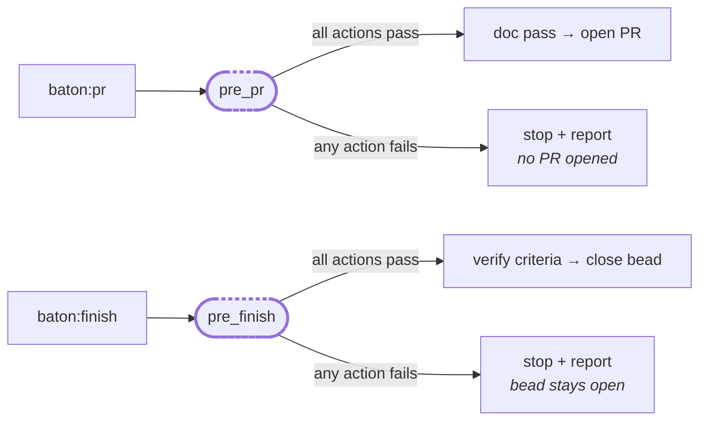
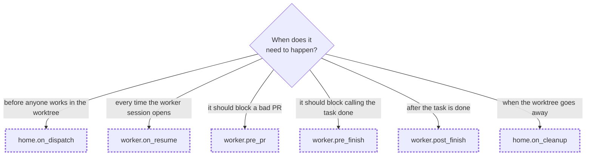

# baton lifecycle hooks

Every place a baton context can inject its own behaviour into the workflow, what fires each one,
and what it gets.

A **lifecycle hook** is a list of actions in your `context.yaml`. baton runs them at fixed points
in the task lifecycle — dispatching a worktree, opening a PR, finishing a task, cleaning up. They
are how a context adds its own gates and side effects **without editing the plugin**: your
typecheck before a PR, your test suite before a bead closes, your tmux teardown after a worktree
goes away.

There are exactly **six**, grouped by which session they run in:

```yaml
hooks:
  home:                 # the orchestrator session you start tasks from
    on_dispatch: []
    on_cleanup: []
  worker:               # the session running inside a task's worktree
    on_resume: []
    pre_pr: []
    pre_finish: []
    post_finish: []
```

`baton:configure` scaffolds this block, `baton:remember` and the retrospective can append to it,
and [`context.schema.json`](./context.schema.json) rejects any key that isn't one of the six — a
typo'd hook name is an error, not a silent no-op.

> [!NOTE]
> **These are not the same thing as the hooks in [`baton/hooks/`](../hooks/).** That directory
> holds *Claude Code harness* hooks (`SessionStart`, `PreToolUse`) that ship with the plugin and
> apply to every context: session detection, and the guard that blocks branch creation in a
> member repo's primary clone. You don't configure those; they aren't the subject of this
> document. "Hook" below always means a lifecycle hook in your `context.yaml`.

---

## The six at a glance

| Hook | Session | Fires in | Fires when | Failure |
|---|---|---|---|---|
| `home.on_dispatch` | home | `baton:start` (Step 7) | after the worktree + branch exist, before the worker session is launched | not a gate |
| `home.on_cleanup` | home | `baton:cleanup-worktrees` (Step 4) | once **per worktree removed** — auto-removed or confirmed | not a gate |
| `worker.on_resume` | worker | `baton:resume` (Step 4) | after the bead loads, before work begins | not a gate |
| `worker.pre_pr` | worker | `baton:pr` (Step 3) | before the doc pass and `gh pr create` — **skipped if a PR is already open** | **gate** — stops the PR |
| `worker.pre_finish` | worker | `baton:finish` (Step 2) | before acceptance criteria are even checked | **gate** — stops the finish |
| `worker.post_finish` | worker | `baton:finish` (Step 6) | after the bead is closed, before cleanup is signalled | not a gate |

A **gate** means: if an action fails, the skill stops and reports instead of continuing. It won't
open a PR or close a bead over a red gate. `autonomous-safe` does **not** relax this — that label
skips waiting for a human's *confirmation*, never a failing check.

Those six skills are the only ones with hook points. `baton:task-add`, `baton:split`,
`baton:doctor` and the rest have none. `baton:session-start` has none of its own either, but its
default `cleanup` startup task invokes `baton:cleanup-worktrees` — so `on_cleanup` does fire from
an ordinary `<name>-start`, one lane over.

---

## The normal flow, with hook points marked

```mermaid
flowchart LR
    subgraph HOME["🏠 home session (orchestrator)"]
        direction TB
        SS["baton:session-start<br/><i>align · doctor · cleanup · status</i>"]
        ST1["baton:start<br/>resolve leaf bead"]
        ST2["create worktree + branch<br/><code>git worktree add</code>"]
        HD(["hooks.home.on_dispatch"])
        ST3["hand off per work_mode<br/><i>launch worker session</i>"]
        SS --> ST1 --> ST2 --> HD --> ST3
    end

    subgraph WORKER["🌿 worker session (inside the worktree)"]
        direction TB
        RS["baton:resume<br/>derive leaf from branch, load bead"]
        WR(["hooks.worker.on_resume"])
        IMPL["implement the acceptance criteria"]
        PR1["baton:pr"]
        WP(["hooks.worker.pre_pr"])
        PR2["doc pass → <code>gh pr create</code>"]
        FI1["baton:finish"]
        WF(["hooks.worker.pre_finish"])
        FI2["verify criteria → doc pass → close bead"]
        WPF(["hooks.worker.post_finish"])
        FI3["label <code>ready-for-worktree-delete</code><br/>→ retrospective"]
        RS --> WR --> IMPL --> PR1 --> WP --> PR2 --> FI1 --> WF --> FI2 --> WPF --> FI3
    end

    subgraph LATER["🏠 a later home session"]
        direction TB
        CW["baton:cleanup-worktrees<br/><i>classify each worktree</i>"]
        CW2["remove worktree + branch"]
        HC(["hooks.home.on_cleanup"])
        CW --> CW2 --> HC
    end

    ST3 -.->|new session| RS
    FI3 -.->|"label read later"| CW

    classDef hook stroke-width:3px,stroke-dasharray:5 4;
    class HD,HC,WR,WP,WF,WPF hook;
```



Dashed nodes are the hook points. The three lanes are three *different sessions*, and the dotted
arrows are the seams between them: the worker is not the session that dispatched it, and the
worktree is removed later by a third session — a worktree can never delete the directory it is
running in.

The two gates, in isolation:



---

## How an action is executed

Each entry in a hook list is a string, and it may be either:

- **a shell command** — `npm run typecheck`, `tmux kill-session -t "$SESSION_NAME" 2>/dev/null || true`
- **a natural-language instruction** — *"Copy `.envrc` from the repo root into the new worktree if
  the repo has one and the worktree doesn't yet…"*

baton doesn't parse the difference; the skill's agent reads the entry and does the sensible thing.
Actions run **in order**, and for a gate, the first failure stops the rest.

Two consequences worth internalizing:

1. **Every action must stand alone.** Each one is executed as its own step, so shell state does
   not carry between entries. `cd` in one action, an exported variable in another — none of it
   survives. Chain with `&&` inside a single entry if you need sequencing, or wrap in a subshell:
   `(cd "$WT" && direnv allow)`.
2. **The variables below are values the agent has in hand at that point**, substituted into your
   action. Write them as `"$LEAF"`, `"$SESSION_NAME"` and so on — quoted, since a `SESSION_TITLE`
   contains spaces.

---

## What a hook gets

The task **identity group** is the five names one unit of work has, all derived in one place
([`scripts/task-identity.sh`](../scripts/task-identity.sh)) so nothing can drift:

| Variable | What it is | Example |
|---|---|---|
| `LEAF` | the bead id | `jbh-zvs` |
| `SLUG` | the written, human-readable half | `kids-overnight-hvac` |
| `BR` | the branch, always `<leaf>-<slug>` | `jbh-zvs-kids-overnight-hvac` |
| `SESSION_NAME` | tmux session name | `kids-overnight-hvac-jbh-zvs` |
| `SESSION_TITLE` | Claude Code session title | `kids overnight hvac (jbh-zvs)` |
| `SESSION_NAME_LEGACY` | transitional: the pre-identity-group name | `baton-jbh-zvs-kids-overnight-hvac` |

Plus the path variables, which only some hooks get:

| Variable | What it is | Example |
|---|---|---|
| `REPO` | the member repo's primary clone | `~/code/homebernetes` |
| `WT_BASE` | the worktree base for that repo | `~/code/homebernetes-worktrees` |
| `WT` | this task's worktree | `~/code/homebernetes-worktrees/jbh-zvs-kids-overnight-hvac` |

### Availability per hook

| | `on_dispatch` | `on_cleanup` | `on_resume` | `pre_pr` | `pre_finish` | `post_finish` |
|---|---|---|---|---|---|---|
| `LEAF` | ✅ | ✅ | ✅ | ✅ | ✅ | ✅ |
| `SLUG` | ✅ | ✅ | ✅ | ➖ | ➖ | ➖ |
| `BR` | ✅ | ✅ | ✅ | ✅ | ➖ | ➖ |
| `SESSION_NAME` | ✅ | ✅ | ✅ | ➖ | ➖ | ➖ |
| `SESSION_TITLE` | ✅ | ✅ | ✅ | ➖ | ➖ | ➖ |
| `SESSION_NAME_LEGACY` | ✅ | ✅ | ✅ | ➖ | ➖ | ➖ |
| `REPO` | ✅ | ➖ | ➖ | ➖ | ➖ | ➖ |
| `WT_BASE` | ✅ | ➖ | ➖ | ➖ | ➖ | ➖ |
| `WT` | ➖ (compose `$WT_BASE/$BR`) | ✅ | ➖ (it's the cwd) | ➖ (cwd) | ➖ (cwd) | ➖ (cwd) |

✅ = the skill computes and exports it before running your actions. ➖ = not guaranteed; don't
rely on it.

**The ➖ cells are recoverable.** Every worker hook runs with the worktree as its cwd, and the
branch carries the whole identity — that's the point of `<leaf>-<slug>`. Recompute it *inside the
same action* that needs it (remember: nothing carries to the next entry):

```bash
eval "$("$BATON/scripts/task-identity.sh" --branch "$(git rev-parse --abbrev-ref HEAD)" --format env)" && <your command>
```

…where `$BATON` is the plugin root. `CLAUDE_PLUGIN_ROOT` is set when the skill runs, but don't
count on it reaching your action's shell — prefer an explicit path, the same way the skills
themselves fall back (`"${CLAUDE_PLUGIN_ROOT:-$HOME/code/maestro/baton}"`).

Never re-derive a session name or title by hand — `task-identity.sh` is the only place that
transform lives, and reimplementing it is exactly the drift the identity group exists to prevent.

---

## Hook reference

### `home.on_dispatch`

**Fires:** in `baton:start`, immediately after the worktree and branch are created (and deps
installed), immediately before the handoff launches the worker session.
**cwd:** the home session's — the workspace repo, *not* the new worktree.
**Gets:** the full identity group, plus `REPO` and `WT_BASE`.

This is the "prepare the worktree before anyone works in it" point. Anything that has to exist
before the worker's first prompt belongs here, because after this the worker is on its own.

The canonical use is seeding files `git worktree add` won't check out. Gitignored files are never
carried into a new worktree, and `post-checkout` does not reliably fire for one, so a `.envrc`
has to be copied explicitly — and then approved, because direnv treats the copy as unapproved
content at its new path even when byte-identical to an already-allowed file elsewhere:

```yaml
on_dispatch:
  - 'if [ -f "$REPO/.envrc" ] && [ ! -f "$WT_BASE/$BR/.envrc" ]; then cp "$REPO/.envrc" "$WT_BASE/$BR/.envrc"; fi'
  - 'if [ -f "$WT_BASE/$BR/.envrc" ] && command -v direnv >/dev/null 2>&1; then (cd "$WT_BASE/$BR" && direnv allow); fi'
```

**Caveats:**
- There is no `WT` here — compose it as `$WT_BASE/$BR`.
- It fires for **every** work mode, including `in-place`, where no worktree was created and
  `$WT_BASE/$BR` therefore does not exist. Guard with `[ -d ... ]` if that matters.
- It cannot change the branch, the leaf, or the identity group; those are already minted, and the
  worker will recompute them from the branch regardless.

### `home.on_cleanup`

**Fires:** in `baton:cleanup-worktrees`, once per worktree actually removed — both the
auto-removed *confirmed-ready* ones and the ones you confirmed by hand. It does **not** fire for
worktrees that were merely inspected and kept. `baton:finish` applies the same logic in the one
case where it removes a worktree directly (running from outside a finished worktree).
**cwd:** the home session's.
**Gets:** the full identity group, plus `WT` (the worktree path being removed).

This is where the worker's tmux session dies. `baton:configure` seeds it by default, because the
new-session handoff otherwise leaks a session every time:

```yaml
on_cleanup:
  - 'tmux kill-session -t "$SESSION_NAME" 2>/dev/null || true'
```

That target is *the same string* `baton:start` used to create the session — both come from
`task-identity.sh` — so the teardown agrees with the launch by construction. It holds for a custom
`handoff.launcher` too: a launcher is *handed* `$SESSION_NAME`, it does not derive one.

**Caveats:**
- **Don't assume `$WT` still exists.** The skill removes the worktree and runs the hook as parts
  of the same removal without pinning an order between them. Treat `$WT` as an identifier for
  *which* worktree this is, not as a directory you can read.
- If `on_cleanup` is empty, `baton:cleanup-worktrees` says so — because the tmux session will
  leak.
- Worktrees created before the identity group existed still carry the old
  `baton-<branch>` session name. `$SESSION_NAME_LEGACY` is exported for exactly that window; add
  a second teardown line if `tmux ls` still shows one.

### `worker.on_resume`

**Fires:** in `baton:resume`, after the leaf bead has loaded, before the agent starts working the
acceptance criteria.
**cwd:** the worktree.
**Gets:** the full identity group.

Empty by default, and usually stays that way — most per-worktree setup is better done in
`on_dispatch`, which runs before the session even opens. Reach for `on_resume` when something must
happen **inside** the worker session, or on **every** resume rather than once at dispatch: warming
a dev server, re-installing deps that drift, printing a context-specific reminder.

**Caveats:**
- It runs on every resume of that worktree, not once per task. Make actions idempotent.
- It is not a gate — a failure here won't stop the session from proceeding.
- It cannot change which bead the session picked up. That is derived from the branch, upstream of
  this point.

### `worker.pre_pr`

**Fires:** in `baton:pr` Step 3 — after the "is there already an open PR?" check, before the
documentation pass and before `gh pr create`.
**cwd:** the worktree.
**Gets:** `LEAF` and `BR` reliably; recompute the rest if you need it.

**This is the PR gate for the context** — the main reason most people write a hook at all:

```yaml
pre_pr:
  - npm run typecheck
  - npm run lint
```

If any action fails, no PR is opened; the skill reports the failure instead. It also holds for
`autonomous-safe` leaves: they skip the human confirmation at PR/merge, never the gate.

**Caveats:**
- **It doesn't fire when a PR is already open.** `baton:pr` short-circuits at Step 2 and reports
  the existing URL, so `pre_pr` is a *PR-creation* gate, not a per-push one. It runs on one
  machine, at PR-open time, once — anything that must hold for every push belongs in CI.
- It cannot modify the PR title or body — that's composed after it, from the commits and the bead.

### `worker.pre_finish`

**Fires:** in `baton:finish` Step 2 — the very first thing after the context and bead resolve, and
notably **before** acceptance criteria are verified, before the documentation pass, and before the
bead closes.
**cwd:** the worktree.
**Gets:** `LEAF` reliably; recompute the rest if you need it.

The "don't let this be called done unless it passes" gate:

```yaml
pre_finish:
  - npm test
```

Fail here and the bead stays open. Again, `autonomous-safe` does not relax it.

**Caveats:**
- Because it runs before criteria verification, it can't see that verdict. It's a mechanical gate
  (tests, build, lint), not a judgement about whether the work is right.
- It's usually a superset of `pre_pr`, not a replacement — `pre_pr` catches problems while the PR
  is still cheap to amend; `pre_finish` catches whatever changed after it opened.

### `worker.post_finish`

**Fires:** in `baton:finish` Step 6 — after the bead is closed (or deliberately left open), before
the merge/cleanup signalling of Step 7 and before the retrospective.
**cwd:** the worktree.
**Gets:** `LEAF` reliably; recompute the rest if you need it.

The "task is done, tell someone" point: post a notification, append to a work log, kick a
downstream sync. Empty by default.

**Caveats:**
- Not a gate — a failure won't un-close the bead.
- The PR may or may not be merged yet at this point; merge handling is Step 7, *after* this hook.
  If your action depends on the merge, check for it (`gh pr view "$BR" --json state`) rather than
  assuming.
- It must not remove the worktree. A session cannot delete its own cwd; that's what the
  `ready-for-worktree-delete` label and a later `baton:cleanup-worktrees` pass are for.

---

## Choosing a hook



By need:

| I want to… | Hook |
|---|---|
| copy or seed a file `git worktree add` won't check out | `home.on_dispatch` |
| approve direnv / prepare the environment for the new session | `home.on_dispatch` |
| install or warm something inside the worker session itself | `worker.on_resume` |
| run typecheck / lint before a PR can open | `worker.pre_pr` |
| require a changelog entry, or any project-specific PR precondition | `worker.pre_pr` |
| run the test suite before a bead can close | `worker.pre_finish` |
| notify a channel, log the completion, sync a downstream tracker | `worker.post_finish` |
| kill the tmux session (or any other per-worktree resource) | `home.on_cleanup` |
| enforce something on every push | *not a hook — use CI* |
| record a durable preference or convention | *not a hook — use `guidance.md` via `baton:remember`* |

---

## What a hook can't do

Worth stating plainly, because the boundary isn't obvious:

- **It can't change the identity group.** `LEAF`, `SLUG`, `BR`, `SESSION_NAME`, `SESSION_TITLE`
  are minted once by `task-identity.sh` and recomputed from the branch everywhere downstream.
  Exporting a different value inside a hook changes nothing outside that action. To change the
  *formats*, use the `naming:` block; the branch itself isn't configurable, since `baton:resume`
  and `baton:cleanup-worktrees` parse its leaf prefix.
- **It can't change control flow beyond pass/fail.** A gate can stop the skill; nothing can make
  it skip a step, take a different branch, or run a different skill.
- **It can't pass state to the next hook.** No shared environment, no shared shell, no ordering
  guarantees between the hook and the skill's own steps beyond what's documented above. Write to a
  file if you genuinely need to hand something forward.
- **It can't edit the plugin, and shouldn't try.** Hooks are the extension point precisely so the
  plugin stays generic — everything context-specific lives in your workspace repo.
- **It isn't a substitute for CI.** Hooks run on one machine, at one moment, for whoever happens
  to be running the skill. Anything that must hold for every push, every contributor, or every
  merge belongs in CI.

## See also

- [`context.example.yaml`](./context.example.yaml) — the annotated `context.yaml`, hooks included.
- [`context.schema.json`](./context.schema.json) — the machine-readable contract; validate with
  `scripts/validate-context.sh` (or `baton:doctor`, which does it on every run).
- [`scripts/task-identity.sh`](../scripts/task-identity.sh) — the one place the five names are
  derived.
- [`../README.md`](../README.md) — contexts, the task model, and the rest of the workflow.
